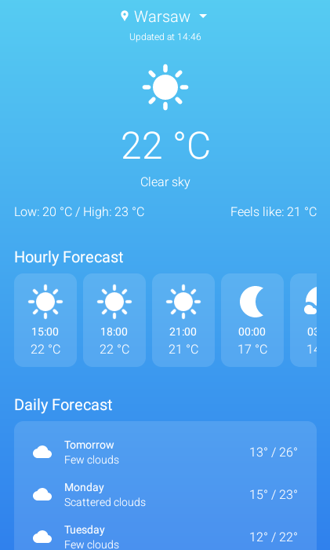
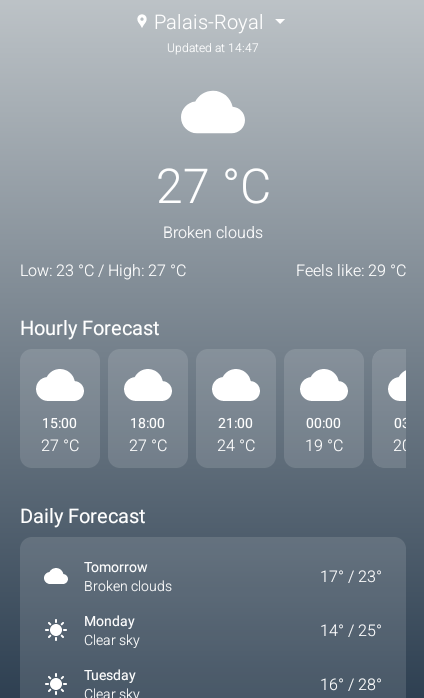

# 📱 Meteo

**Meteo** is an open-source Android application that presents daily weather forecasts through a clean and modern interface. It displays 5-day and hourly forecasts using data from the OpenWeather API. Users can view forecasts for different cities and save their preferred location. The interface features dynamic backgrounds that change based on the time of day and current weather conditions.

## 🚀 Features
- Minimal and modern interface designed with MVVM architecture
- Location-based weather forecasting
- City search and selection
- 5-day and 3-hour interval hourly weather forecasts
- Dynamic background gradients based on time of day and weather conditions (morning, afternoon, evening, night, sunny, rainy, etc.)
- Integration with OpenWeather API & Geocoding API

## 📸 Screenshots

<table>
  <tr>
    <td> </td>
   </tr> 
</table>

<table>
  <tr>
    <td> </td>
   </tr> 
</table>

## 🧠 Built With

- `Kotlin`  
- `Retrofit`
- `SharedPreferences`  
- `BottomSheetDialogFragment`
- `OpenWeather API & Geocoding API`

## IMPORTANT NOTE
- You should use your own OpenWeather API key to use the application. You can add your API_KEY in Constants.kt object file.

## 📦 Compile

1. Clone the repository:
   ```bash
   git clone https://github.com/gorkemoji/android_packages_apps_Meteo.git

2. Open with Android Studio and press run button!
